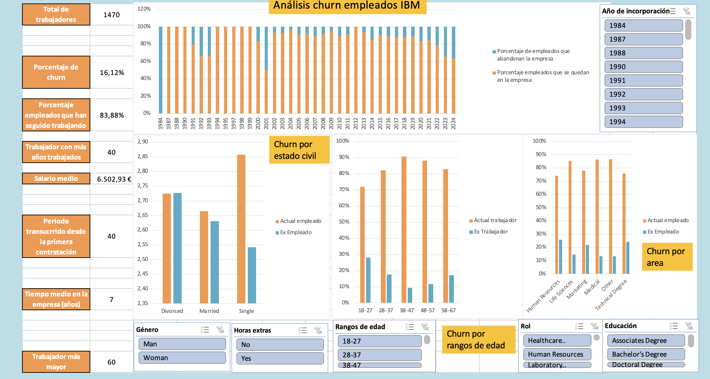

# Laboratorio 1: Dashboard en Excel  

**Descripción del Proyecto** 

El proyecto sirve de analisis descriptivo acerca de las ventas realizadas por empresas minoristas a nivel internacional. Este es mi primer acercamiento a Excel, beware.

**Estructura del Proyecto** 

        ├── Datos/entrega.xlsx                       # Excel con el análisis y dashboard
        ├── Datos/original.xlsx                      # Excel con los datos iniciales
        ├── README.md                                # Descripción del proyecto
        ├── Imagenes                                 # Imágenes usadas en el README.md 

**Instalación y Requisitos** 

El proyecto está desarrollado con la versión de Microsoft Excel 16.91 para Mac. Para visualizarlo es necesario una versión que permita: Tablas dinámicas, PowerQuery y gráficas.

**Resumen y resultados** 

La empresa opera a nivel global con presencia en 17 países y 5 continentes, logrando un desempeño sólido en términos de ingresos, transacciones y eficiencia operativa. 

Estos datos se encuentran entre 2012 - 2014(Q2).

*** Big numbers *** 

- A lo largo de 40 años ha habido 1470 incorporaciones.
    - Con una media de 7 años trabajados en la empresa.
    - Nuestro trabajador más mayor tiene 60 años.

A lo largo de este análisis, he buscado ver cómo se ve afectado el churn por diferentes factores, como pueden ser:
- Edad del trabajador
- Estado civil
- Departamento en el que trabaja
- Estudios previos
- Área de estudios

Estos y otros datos, se pueden consultar en el dashboard y las diferentes páginas.

**Links** 

Repositorio https://github.com/miguelow/Laboratorio1-DashboardExcel

Linkedin https://www.linkedin.com/in/miguel-ortega-ward/

